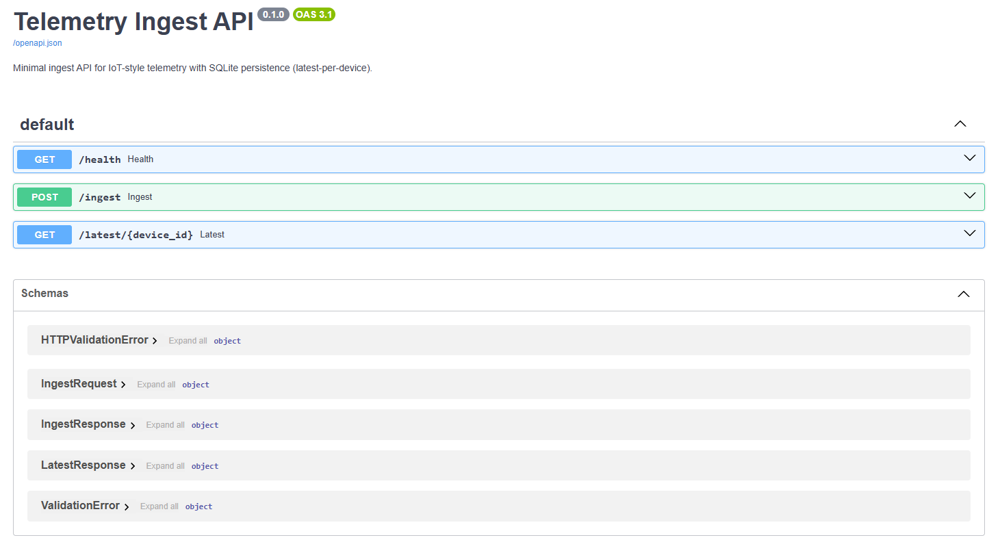
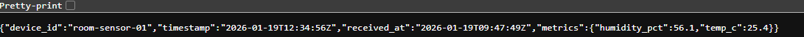
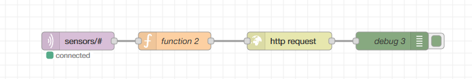

# Telemetry Ingest API (FastAPI + SQLite)

A small backend service that **accepts sensor telemetry over HTTP**, validates it, and stores the **latest reading per device** in SQLite.
This makes MQTT-produced data easy to consume by any system that can speak HTTP (web apps, mobile apps, scripts, services).

## What it does
- **Ingest** telemetry via `POST /ingest` (validate + store)
- Query the **latest** stored telemetry via `GET /latest/{device_id}`
- Provide a simple **health** endpoint via `GET /health`
- Persist data in **SQLite** (one row per device, updated on each ingest)

### Why this is useful
MQTT is great for streaming messages, but many consumers prefer HTTP. This API provides:
- a **stable “current state” store** (latest reading survives restarts)
- a **standard HTTP interface** for other systems
- a **validation gate** that rejects malformed payloads (basic junk filtering)

## Architecture (high level)
Device publishes to MQTT → Node-RED subscribes → Node-RED forwards to this API → other apps query via HTTP.

## Endpoints
- `GET /health` → `{ "status": "ok" }`
- `POST /ingest` → validates payload and upserts latest reading by `device_id`
- `GET /latest/{device_id}` → returns latest stored reading or 404

## Data contract

### `POST /ingest` payload
```json
{
  "device_id": "room-sensor-1",
  "timestamp": "2026-01-19T12:34:56Z",
  "metrics": {
    "temp_c": 25.4,
    "humidity_pct": 56.1
  }
}
```

Notes:
- `timestamp` is optional (server will assign current UTC time if omitted)
- `metrics` must contain **at least one** numeric key/value pair

### `GET /latest/{device_id}` response
```json
{
  "device_id": "room-sensor-1",
  "timestamp": "2026-01-19T12:34:56Z",
  "received_at": "2026-01-19T12:35:02Z",
  "metrics": {
    "humidity_pct": 56.1,
    "temp_c": 25.4
  }
}
```

## Quickstart (Windows / PowerShell)

### 1) Setup venv + install
```powershell
py -3.12 -m venv .venv
.\.venv\Scripts\Activate.ps1
pip install -r requirements.txt
```

### 2) Run the server
```powershell
uvicorn app.main:app --reload
```

Open API docs (interactive UI):
- http://127.0.0.1:8000/docs

Health check:
- http://127.0.0.1:8000/health

## Using the UI (`/docs`)
FastAPI provides Swagger UI:
1) Open `http://127.0.0.1:8000/docs`
2) Expand an endpoint (e.g., `POST /ingest`)
3) Click **Try it out** → edit JSON → **Execute**
4) Use `GET /latest/{device_id}` to confirm the stored value

## Example requests (PowerShell)

### Ingest
```powershell
$body = @{
  device_id = "room-sensor-1"
  timestamp = "2026-01-19T12:34:56Z"
  metrics   = @{ temp_c = 25.4; humidity_pct = 56.1 }
} | ConvertTo-Json -Depth 4

Invoke-RestMethod -Method Post -Uri "http://127.0.0.1:8000/ingest" -ContentType "application/json" -Body $body
```

### Query latest
```powershell
Invoke-RestMethod -Uri "http://127.0.0.1:8000/latest/room-sensor-01"
```

## Storage
- Default DB path: `data/telemetry.db`
- Override with environment variable:
  - `TELEMETRY_DB_PATH` (see `.env.example`)

This service stores **latest-per-device** using an upsert keyed on `device_id`.

## Tests
```powershell
pytest -q
```

## CI
GitHub Actions runs `pytest` on every push/PR (see `.github/workflows/ci.yml`).

## Repo structure
```text
app/
  main.py      # FastAPI app + endpoints
  models.py    # Pydantic request/response models + validation
  db.py        # SQLite connection + schema init
  repo.py      # SQL operations (upsert + fetch)
tests/
  test_health.py
  test_ingest.py
  test_latest.py
```

## Node-RED integration (MQTT → HTTP)
In Node-RED:
- Subscribe to your MQTT topics (e.g., `sensors/#`)
- Transform to the ingest payload shape
- Use an HTTP Request node to `POST /ingest`

If Node-RED runs in Docker and this API runs on your host PC, the URL is typically:
- `http://host.docker.internal:8000/ingest`

If Node-RED runs on your host PC, use:
- `http://127.0.0.1:8000/ingest`

## Troubleshooting
- If you see import errors in tests, ensure:
  - `app/__init__.py` exists
  - you run tests from repo root: `python -m pytest -q`
  - (recommended) add `pytest.ini` with:
    ```ini
    [pytest]
    testpaths = tests
    pythonpath = .
    ```

## Screenshots


